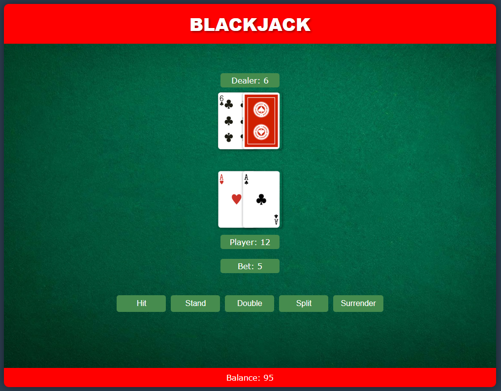

# Blackjack Web App

A browser-based implementation of the classic casino card game Blackjack, converted from a Python/Tkinter application to a modern web application using HTML, CSS, and JavaScript.

## Demo

[Play the game here](https://blackjack.maber.io/)



## Features

- Classic Blackjack gameplay with standard casino rules
- Full game functionality including Hit, Stand, Double, Split, and Surrender
- Realistic card visuals
- Persistent game state that saves between sessions
- Responsive design that works on desktop and mobile
- Loan system when balance runs low

## Technologies Used

- HTML5
- CSS3
- Vanilla JavaScript (ES6+)
- Local Storage API for persistence
- No external libraries or frameworks required

## How to Play

1. Use the slider to set your bet amount
2. Click "Place Bet" to start the game
3. Use the action buttons to play your hand:
   - **Hit**: Take another card
   - **Stand**: End your turn
   - **Double**: Double your bet and take exactly one more card
   - **Split**: If you have two cards of the same value, split them into two separate hands
   - **Surrender**: Give up half your bet and end the hand

The goal is to get closer to 21 than the dealer without going over. Face cards are worth 10, Aces are worth 1 or 11, and all other cards are worth their face value.

## Project Structure

- `index.html` - Main HTML file
- `css/` - Stylesheet directory
  - `styles.css` - Main CSS file
- `js/` - JavaScript files
  - `blackjack.js` - Game logic
  - `ui.js` - User interface management
  - `storage.js` - Local storage handling
- `assets/` - Images and other resources
  - `images/` - Card faces and UI elements

## Installation and Setup

To run this project locally:

1. Clone this repository
2. Navigate to the project directory
3. Open index.html in your browser

Alternatively, use a local development server:

```bash
# Using Python (if installed)
python -m http.server

# Using Node.js (if installed)
npx http-server
```

## Deployment

This app is deployed on Azure Static Web Apps. The live version can be found at [blackjack.maber.io](https://blackjack.maber.io/).

## Browser Compatibility

Tested and working on:
- Chrome (latest)
- Firefox (latest)
- Edge (latest)
- Safari (latest)

## Requirements

- Modern web browser with JavaScript enabled
- No server-side dependencies
- No build process required

## Future Improvements

- Add sound effects for card dealing and game actions
- Implement card animations
- Add multiplayer functionality
- Create a high score leaderboard
- Add more blackjack variations

## Related Projects

A Python version of this game is available in the [Blackjack](/Blackjack) directory of the main repository.

## Credits

- Card images from [the original Python project](/Blackjack/images/card_faces)
- Felt background texture from [the original Python project](/Blackjack/images/felt.png)

## License

This project is for personal and educational use.
